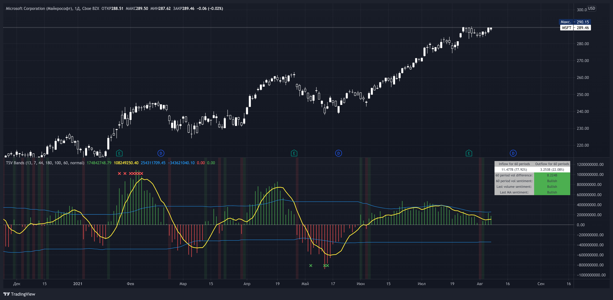

# Time Segmented Volume Bands - TradingView script

[Link to the script](https://ru.tradingview.com/script/fmuLoK0d-time-segmented-volume-bands/)

This time I took as a basis TSV - Time Segmented Volume, a rather rare one, almost never mentioned on TradingView.

TSV is a leading indicator because its movement is based on both the movement of the stock price and its volume. Ideal entry and exit points are usually found when a stock moves through a baseline. This indicator is similar to the more well-known balance volume (OBV) because it measures the amount of money flowing in or out of a particular stock.

## What is their main difference between TSV and OBV?

Time Segmented Volume is used to eliminate distortions of the standard volume graph. OBV is based on cumulative total volume, while TSV compares the current time period with the previous one, without a subtotal.

## What I added on my own script

* Bands, similar to Bollinger. The main idea is to have an idea of ​​the average inflow and outflow of volumes from / to shares for a particular period. We have an opportunity to estimate how much the current volumes differ from the average for 60 days (all values ​​can be flexibly adjusted).
Excess markers by the current average volume (sensitivity can be adjusted separately).
* A table that calculates the total sentiment (force) of volume on average for N periods in comparison with the current one.
* Sell/buy markers

## How to read a TSV graph

The main graph is a histogram. Green bars mean an inflow of volume, red bars mean an outflow. When the red volume crosses the baseline zero, it is considered a buy signal (in the classic TSV version). A similar sell signal - just the  opposite. I highlight them with a colored background fill.
It is especially important to find divergences on the chart. For example, when the volume peaks getting lower but the price rises (short).

The yellow line is the average TSV for 7 periods. Just a smoother lagging line.

Blue stripes. Above - the average inflow of volumes over N periods (44 days). Below - the average outflow.

Markers are additional buy / sell signals generated when the current TSV value exceeds the average for N periods. In the script settings, you can choose how many percent deviations from the average should occur in order to count it as a strong signal (by default, an excess of 180% for selling, 100% for buying). The main idea of ​​the marker is to catch a better price than with the standard TSV logic (take at the intersection of the zero line). The marker can serve as both an assistant and drive into a trap. If you are not very confident, then it is better to adhere to standard practice, and set the excess of markers to completely abnormal situations, so that it triggers less often.

Colored background - a classic buy or sell zone (when crossing the TSV baseline).

Table - you can configure its presence and size in the settings. On it you can estimate the sentiment of the movement of money for the last N periods. Pay particular attention to the % value in parentheses. It shows the strength of the trend in volumes over N periods.

The basic rule, as with any trend indicator: *do not trade against the trend. A sell signal in a constantly rising channel is not a short signal. This is a signal for a possible fixation of a part of the position. No more.*

### How do I use this indicator?

For starters, I never make decisions purely based on an indicator. TSV plays the role of a clearer visualization of volumes for me. If I see that the volumes are fading away (thin market), then I try not to enter the trade. For the last two weeks, while picking charts, I completely abandoned standard volume bars in favor of TSV due to it's greater  informative.
